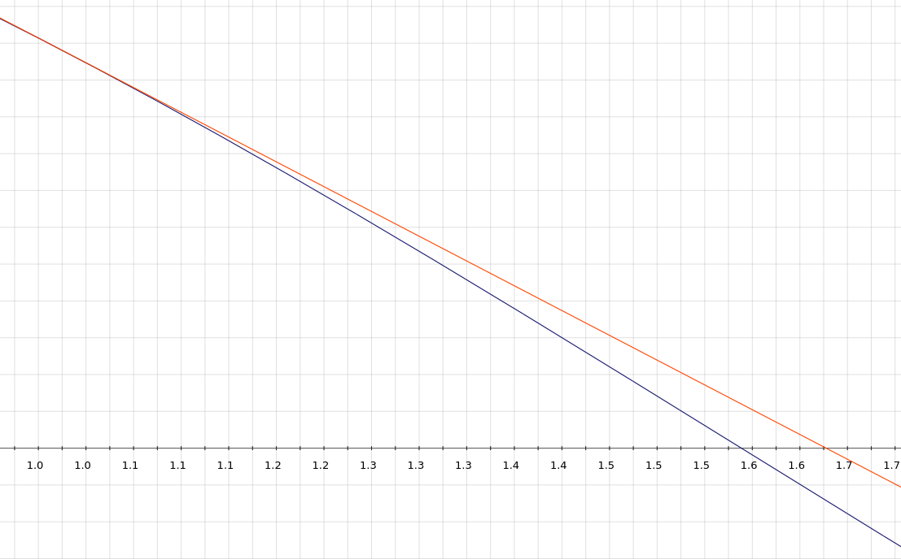

# Metodo di Newton

Implementazione del metodo di Newton per il calcolo degli zeri semplici ($f'(\alpha) \not = 0$) di una funzione $(f(\alpha) = 0)$

## Idea generale
L'algoritmo di basa sull'approssimazione ([Taylor](https://it.wikipedia.org/wiki/Teorema_di_Taylor)) dello zero mediante l'intersezione di rette tangenti con l'asse delle ascisse a partire da un punto iniziale (input) facendo ricorso alla ripetuta approssimazione della funzione con la sua retta tangente ($T_1$).  
## Iterata generale

$$ x^{(k+1)} = x^{(k)}-\frac{f(x^{(k)})}{f'(x^{(k)})}$$ 

----

## Esempio 

Sia $f: \mathbb{R} \longrightarrow [-1, 1]$ t.c. $f(x) = cos(x)$,
siano, inoltre 
* $x_0 = 1$
* $f'(x) = -\sin(x)$
* $tolleranza = 10^{-10}$

$$ x^{(1)} = 1 - \frac{\cos(1)}{-\sin(1)} \approx 1.64... $$

Oss. L'algoritmo si ferma quando trova un'approssimazione della radice al disotto di una tolleranza (input) oppure quando raggionge il massimo numero di passi stabilito (input).

### Di seguito riportata la tabella delle varie iterate generate con Matlab:

| Passo |    Valore x    | Stima errore  |
|:----: |      :----:    |    :----:     |
| 1     | 1.6420926159   | 6.42e-01      |
| 2     | 1.5706752772   | 7.14e-02      |
| 3     | 1.5707963268   | 1.21e-04      |
